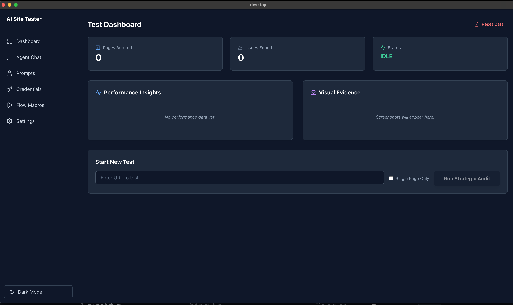

# Autonomous Site Tester (Still behind will pushed a refactored and better planned solution when i have the chance)

An advanced, multi-agent autonomous web testing platform that leverages LLMs for intelligent site exploration, accessibility auditing, and visual validation.

## 📸 Screenshot


## 🚀 Overview

The Autonomous Site Tester is designed to explore web applications like a human would. It uses a suite of specialized agents orchestrated by a central engine to identify functional bugs, accessibility violations, and visual regressions across different operating systems.

## 🏗️ Architecture

- **Agent Runtime**: The heart of the system, containing the `Orchestrator`, `TaskPlanner`, and `DecisionEngine`.
- **Specialized Agents**: 
  - `CrawlerAgent`: Navigates and discovers pages.
  - `FormAgent`: Analyzes and fills complex forms.
  - `AccessibilityAgent`: Performs real-time WCAG audits.
  - `VisionAgent`: detects visual anomalies and layout shifts.
- **Browser Engine**: Manages Playwright instances with support for both Headless and Headed modes.
- **Computer Control**: Native automation for cross-platform (Mac, Windows, Linux) mouse and keyboard interaction.
- **Report Engine**: Generates professional Excel and HTML reports with severity-based issue tracking.

## 🛠️ Getting Started

### Prerequisites
- Node.js (v18+)
- Playwright browsers installed: `npx playwright install`
- Native tools for computer control (e.g., `xdotool` on Linux, PowerShell on Windows).

### Installation
```bash
npm install
npm run build
```

### Running the App
```bash
npm run dev
```

## 📊 Reporting
Once a task is complete, an Excel report is automatically generated and saved to your `Downloads` folder, detailing all issues found during the session.

## 🛡️ Security
API keys are encrypted using AES-256-GCM and stored locally in an SQLite database.
