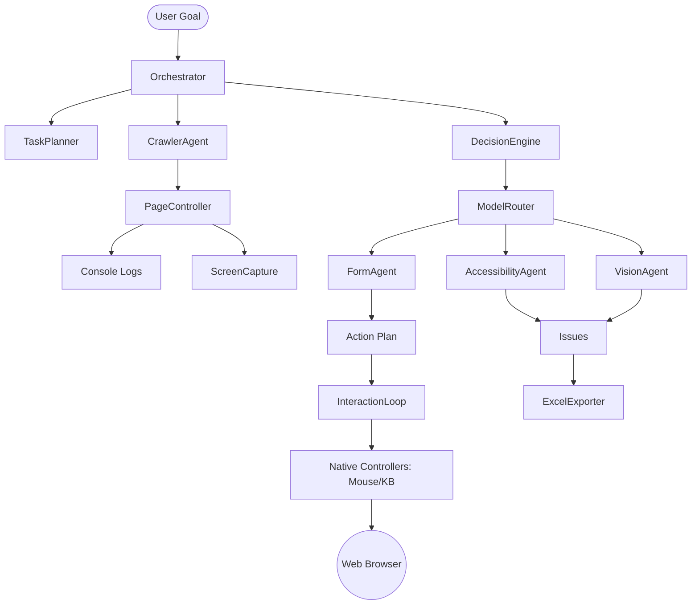

# System Workflow: Step-by-Step

This document explains how the Autonomous Site Tester operates, from user input to the final report.

## 1. Task Initialization
- **Input**: The user provides a Goal (e.g., "Test the signup flow on example.com") and an optional Start URL.
- **Planning**: The `TaskPlanner` deconstructs the goal into a series of logical steps.
- **Configuration**: The `Orchestrator` loads AI settings and launches the `PlaywrightManager` with configured visibility (Headed/Headless) and speed (SlowMo).

## 2. The Interaction Loop
For every page discovered:
1.  **Navigation**: `CrawlerAgent` uses `PageController` to visit the URL.
2.  **Perception**:
    - **DOM Extraction**: The system pulls the page structure.
    - **Visual Capture**: `ScreenCapture` takes a full-page screenshot.
    - **Log Collection**: `PageController` retrieves real-time console messages.
3.  **Reasoning**:
    - The `DecisionEngine` communicates with the LLM via `ModelRouter` to decide the "Next Best Action" based on the goal.
    - **Specialized Analysis**:
        - `FormAgent` analyzes any detected `<form>` elements to suggest valid test data.
        - `AccessibilityAgent` audits the DOM for WCAG violations.
        - `VisionAgent` compares the screenshot against expected layouts.
4.  **Action Execution**:
    - If a UI interaction is needed, `VisionDetection` extracts pixel-accurate coordinates.
    - `MouseController` and `KeyboardController` execute native OS-level commands to interact with the page.

## 3. Issue Detection & Collection
- As the loop progresses, the `IssueDetector` classifies logs, errors, and agent findings into a central `issues` list.
- Issues are weighted by severity (Critical, High, Medium, Low).

## 4. Completion & Export
- Once the goal is reached or the crawl limit is hit, the `Orchestrator` triggers the `ReportBuilder`.
- **ExcelExporter**: Generates a stylized `.xlsx` file containing:
    - Summary metrics (pages visited, total issues).
    - Detailed issue logs with timestamps, URLs, and severity-based coloring.
- The report is saved to the user's local system for review.

---

## Agent-to-Agent Communication Flow

